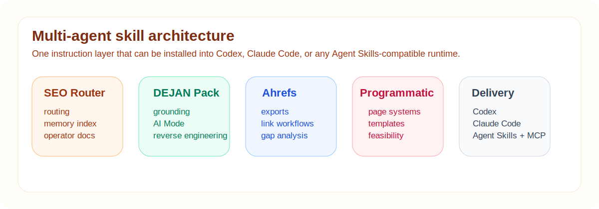

<p align="center">
  
</p>

# SEO Skills Pack

Portable Codex skills and memory for serious SEO work.

This repository is the instruction layer behind my local SEO system. It bundles the operator skills, router memory, DEJAN reverse-engineering pack, and curated SEO notes that make the retrieval layer actually useful.

If `seo-vector-snapshot` is the memory engine, this repo is the operating system wrapped around it.

## What You Get

- the full SEO router and memory library
- the DEJAN AI-search reverse-engineering pack
- Ahrefs and programmatic SEO helper skills
- durable dated memory notes and source-canon notes
- a one-command installer for another laptop

## Snapshot At A Glance

| Metric | Value |
| --- | ---: |
| Captured | `2026-03-20` |
| Skill directories | `5` |
| Markdown notes inside `skills/seo` | `140` |
| Markdown files inside `skills/dejan-ai-reverse-engineering` | `6` |
| Durable memory notes | `7` |

<p align="center">
  
</p>

## Included In The Pack

| Path | Purpose |
| --- | --- |
| `skills/seo` | primary SEO router, memory layer, and operating docs |
| `skills/seo-coral` | specialist SEO role pack |
| `skills/dejan-ai-reverse-engineering` | AI-search, grounding, AI Mode, and citation analysis |
| `skills/ahrefs` | backlink and export-driven workflows |
| `skills/programmatic-seo` | scalable page-system and feasibility workflows |
| `memories/*.md` | durable dated notes from the live research system |

## Why This Repo Matters

Without a skill layer, a vector DB is just stored text.

This repo adds the missing parts:

- routing
- specialist instructions
- curated memory organization
- portable SEO context on a fresh machine

That means a second laptop does not just have files. It has working SEO judgment scaffolding.

## Install Into Codex

```bash
git clone https://github.com/vijaychauhanseo/seo-skills-pack.git
cd seo-skills-pack
./scripts/install_to_codex.sh
```

Default install target:

- `~/.codex`

Override the target:

```bash
CODEX_HOME=/path/to/codex-home ./scripts/install_to_codex.sh
```

## Best Paired Setup

For full portability:

1. Install this repo into `~/.codex`
2. Clone [`seo-vector-snapshot`](https://github.com/vijaychauhanseo/seo-vector-snapshot)
3. Use the DB with the installed skills for query + routing

Example:

```bash
SQUAD_MEMORY_SKILLS_ROOT=~/.codex/skills \
python3 ../seo-vector-snapshot/tools/squad_memory.py decide \
  "Need a practitioner for AI Mode, grounding, and GSC reporting" \
  --db ../seo-vector-snapshot/db/squad_memory.db
```

## Best Use Cases

- AI search reverse engineering
- AI Overviews and grounding diagnostics
- practitioner-informed SEO analysis
- programmatic SEO planning
- export-driven Ahrefs workflows
- multi-source SEO memory on a second machine

## Not Just Generic SEO Notes

This pack includes:

- practitioner canon from DEJAN, Glenn Gabe, Marie Haynes, Patrick Stox, Cindy Krum, Lily Ray, Brodie Clark, Mike King, and others
- durable notes built from live ingestion and manual curation
- role-pack structure so the system knows which lens to apply

## Companion Repository

The retrieval snapshot that pairs with this pack lives here:

- [`seo-vector-snapshot`](https://github.com/vijaychauhanseo/seo-vector-snapshot)

Use this repo for skill execution and memory routing.
Use the vector snapshot for portable retrieval and query resolution.

## Social Preview Asset

If you want a custom GitHub social preview card for this repo, use:

- `assets/social-preview.png`

## License

MIT. See [`LICENSE`](LICENSE).
